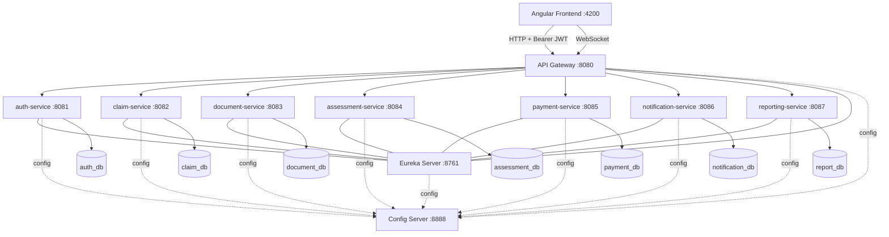

# ClaimSwift System Documentation

## 1. System Overview

ClaimSwift is a distributed claims-processing platform built with Spring Boot and Spring Cloud.
The platform is organized around domain microservices, with centralized configuration, service discovery, and gateway-based access.

Core goals:
- strong service isolation per domain
- secure access through JWT
- full claim lifecycle support
- observable and testable infrastructure

## 2. Architecture Diagram



## 3. Service Responsibilities

| Service | Port | Primary Responsibility | Data Store |
|---|---:|---|---|
| `config-server` | 8888 | Central configuration for all services | N/A |
| `eureka-server` | 8761 | Service discovery and registry | N/A |
| `api-gateway` | 8080 | Single entrypoint, JWT validation, routing, circuit breaker fallback | N/A |
| `auth-service` | 8081 | Registration, login, token refresh, user identity | `auth_db` |
| `claim-service` | 8082 | Claim creation, updates, assignment, status workflow | `claim_db` |
| `document-service` | 8083 | Document upload/download and metadata by claim | `document_db` |
| `assessment-service` | 8084 | Assessment decisions, adjustments, payment trigger | `assessment_db` |
| `payment-service` | 8085 | Payment processing and payment status | `payment_db` |
| `notification-service` | 8086 | User notifications + internal event notifications + WebSocket | `notification_db` |
| `reporting-service` | 8087 | Aggregated claim/payment/adjuster reports, PDF exports | `report_db` |

## 4. API Documentation (Gateway-First)

Base URL for clients:
- `http://localhost:8080/api`

Gateway route mapping:
- `/api/auth/**` -> `auth-service`
- `/api/claims/**` -> `claim-service`
- `/api/documents/**` -> `document-service`
- `/api/assessments/**` -> `assessment-service`
- `/api/payments/**` -> `payment-service`
- `/api/notifications/**` -> `notification-service`
- `/api/reports/**` -> `reporting-service`

Main endpoint groups:
- Auth: register, login, refresh, me, logout
- Claims: create/read/update, assign, status transitions, search, statistics, internal reporting APIs
- Documents: upload, list by claim/user/type, download, delete, internal count API
- Assessments: create, decision, adjustment, fetch by claim, request, completion notify
- Payments: process payout, lookup by claim, internal summary/status APIs
- Notifications: user inbox/read state, send, internal status/payment event APIs
- Reporting: claims summary, payments, adjuster performance, PDF exports, event ingestion

Detailed per-endpoint behavior is documented in `API_CALLS_EXPLAINED.md`.

## 5. Inter-Service Communication

Main synchronous service-to-service flows:
- `claim-service` -> `assessment-service`: assessment request and completion signal
- `assessment-service` -> `claim-service`: claim status updates
- `assessment-service` -> `document-service`: document count validation
- `assessment-service` -> `payment-service`: internal auto-process payment request
- `payment-service` -> `claim-service`: post-payment status update
- `claim-service` -> `reporting-service`: claim events and status changes
- `payment-service` and `claim-service` -> `notification-service`: internal notification events
- `reporting-service` -> `claim-service` and `payment-service`: internal aggregation reads

## 6. Deployment Instructions

### 6.1 Prerequisites

- Java 17
- Maven 3.9+
- MySQL 8+
- Node.js 18+ (frontend)

### 6.2 VS Code CMD Environment Setup

Use CMD in VS terminal and set Maven only for current terminal session:

```cmd
set "MAVEN_HOME=C:\Users\shashank.nath\tools\apache-maven-3.9.12\apache-maven-3.9.12"
set "PATH=%MAVEN_HOME%\bin;%PATH%"
```

### 6.3 Database Setup

```sql
CREATE DATABASE auth_db;
CREATE DATABASE claim_db;
CREATE DATABASE document_db;
CREATE DATABASE assessment_db;
CREATE DATABASE payment_db;
CREATE DATABASE notification_db;
CREATE DATABASE report_db;
```

Credentials/URLs are read from Config Server files under:
- `config-server/src/main/resources/config/*.yml`

### 6.4 Build

From repository root:

```cmd
mvn clean install -DskipTests
```

### 6.5 Startup Order

Start in this order:

1. `config-server`
2. `eureka-server`
3. `auth-service`
4. `claim-service`
5. `document-service`
6. `assessment-service`
7. `payment-service`
8. `notification-service`
9. `reporting-service`
10. `api-gateway`

Example command pattern from root:

```cmd
mvn -pl config-server spring-boot:run
mvn -pl eureka-server spring-boot:run
mvn -pl auth-service spring-boot:run
mvn -pl claim-service spring-boot:run
mvn -pl document-service spring-boot:run
mvn -pl assessment-service spring-boot:run
mvn -pl payment-service spring-boot:run
mvn -pl notification-service spring-boot:run
mvn -pl reporting-service spring-boot:run
mvn -pl api-gateway spring-boot:run
```

Frontend:

```cmd
cd frontend-angular
npm install
npm start
```

### 6.6 Deployment Verification Checklist

Infrastructure verification:
- Config Server health: `http://localhost:8888/actuator/health`
- Eureka dashboard: `http://localhost:8761`
- Gateway health: `http://localhost:8080/actuator/health`

Service discovery verification:
- All 8 app services plus gateway appear in Eureka as `UP`

Config import verification:
- Each service startup logs successful Config Server fetch

Gateway routing verification:
- `GET http://localhost:8080/api/auth/health`
- `GET http://localhost:8080/api/claims/health`

Frontend integration verification:
- Angular uses `http://localhost:8080/api` only (`frontend-angular/src/environments/environment.ts`)

## 7. Notes for Developers and Evaluators

- API Gateway is the only supported client entrypoint for HTTP APIs.
- Domain services still expose direct ports for local diagnostics, but frontend should not consume them.
- Build outputs, runtime logs, and test artifacts are generated content and should not be treated as source documentation.
